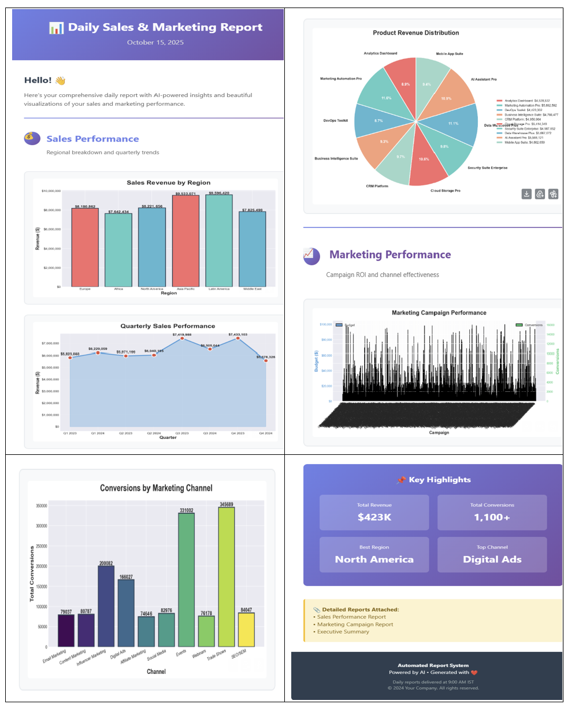
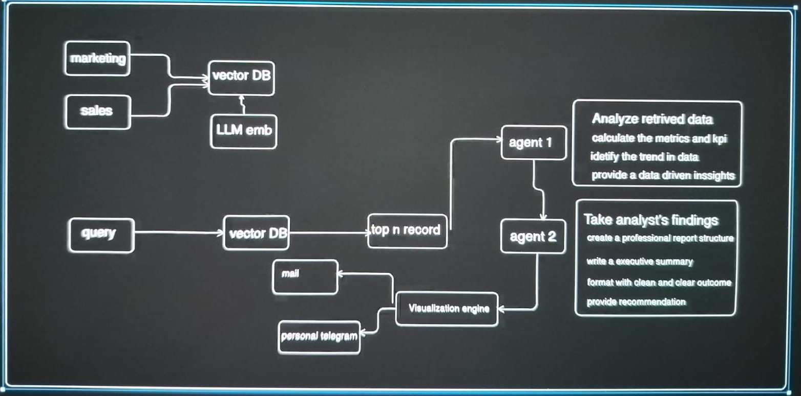

# Auto Report Generator Sytem

**Auto Report Generator** is a scheduling-based reporting system built with **Microsoft AutoGen** that automatically generates and delivers reports at predefined intervals.



The **Auto Report Generator** uses a multi-agent workflow powered by **Microsoft AutoGen** to automate data analysis and reporting. Data from sources like marketing and sales is embedded using an **LLM** and stored in a **Vector Database** for quick semantic retrieval. On a scheduled trigger, the system processes user or system queries to extract the top relevant records, which are analyzed by **Agent 1** to calculate metrics, KPIs, and identify trends. **Agent 2** then formats these insights into a professional, well-structured report with summaries, recommendations, and visualizations. Finally, the reports are automatically delivered through  **email, WhatsApp, or Telegram** .

## How to run?

```
https://github.com/singhmanpreet1308/Auto_report_generator_system_using_msautogen.git
```

### Steps 1 - Create a conda environment after opening the repository

```
conda create -n <Environment_Name> python=3.10 -y
```

```
conda activate <Environment_Name>
```

### Step 2 - Install the requirements

```
pip install -r requirements.txt
```

#### Workflow



### Run Application

```
python scheduler.py now
```
