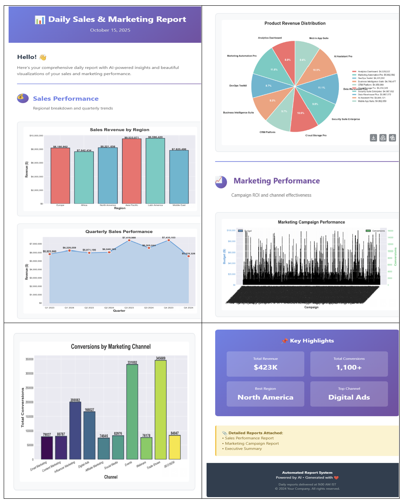
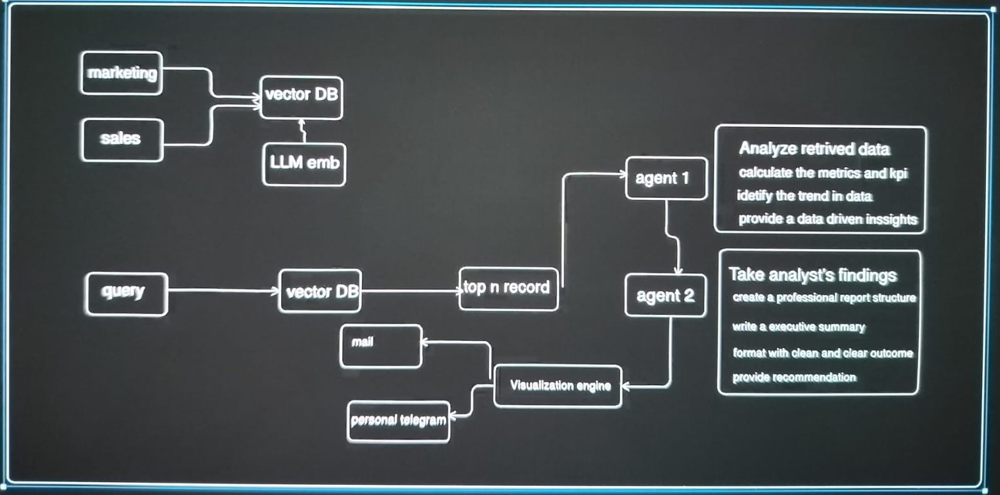

# Auto Report Generator Sytem

Auto Report Generator is an AI-powered automated reporting system designed to reduce the manual effort involved in preparing recurring business reports.

The system uses Microsoft AutoGen, Large Language Models (LLMs), Retrieval-Augmented Generation (RAG), and a Vector Database to retrieve relevant business information, analyse performance, identify important trends, and automatically generate structured management reports.

Instead of manually collecting data, analysing KPIs, writing summaries, and preparing the same reports repeatedly, the system uses a multi-agent AI workflow to automate much of the reporting process.




## 🎯Business Problem

Businesses generate large amounts of operational, sales, and marketing data. However, converting this information into useful recurring reports often requires significant manual effort.

A typical reporting process may involve:

Collecting information from multiple business datasets

Identifying relevant records

Calculating and reviewing KPIs

Comparing business performance

Identifying trends and unusual changes

Writing management summaries

Preparing recommendations

Repeating the same process daily, weekly, or monthly

This creates several challenges:

### Time-Consuming Reporting

Analysts may spend significant time repeatedly preparing similar reports instead of focusing on deeper analysis and decision support.

### Delayed Insights

Important changes in sales, marketing, or operational performance may not be identified until someone manually reviews the data.

### Reporting Inconsistency

Reports created manually can differ in structure, level of detail, and interpretation depending on who prepares them.

### Repetitive Analytical Work

Recurring KPI analysis and report preparation involves tasks that can often be partially automated.

## 💡Proposed Solution

The Auto Report Generator introduces an agentic AI workflow that automates the reporting lifecycle.

The system combines:

Business Data → Vector Database → RAG Retrieval → AI Analysis → Report Generation → Automated Delivery

Rather than asking a single LLM to perform the entire reporting process, the solution separates responsibilities between specialised AI agents.

This makes the workflow easier to manage and allows individual agents to focus on specific reporting tasks.

## 🏗️ Solution Architecture
                    ┌─────────────────────┐
                    │    Business Data    │
                    │  Sales / Marketing  │
                    └──────────┬──────────┘
                               │
                               ▼
                    ┌─────────────────────┐
                    │   Data Embeddings   │
                    │        + LLM        │
                    └──────────┬──────────┘
                               │
                               ▼
                    ┌─────────────────────┐
                    │   Vector Database   │
                    │ Semantic Knowledge │
                    └──────────┬──────────┘
                               │
                               ▼
                    ┌─────────────────────┐
                    │   RAG Retrieval     │
                    │ Relevant Records    │
                    └──────────┬──────────┘
                               │
                               ▼
                 ┌───────────────────────────┐
                 │      Agent 1              │
                 │   Data Analyst Agent      │
                 │                           │
                 │ • Analyse information     │
                 │ • Evaluate KPIs           │
                 │ • Identify trends         │
                 │ • Detect key findings     │
                 └─────────────┬─────────────┘
                               │
                               ▼
                 ┌───────────────────────────┐
                 │       Agent 2             │
                 │   Report Writer Agent     │
                 │                           │
                 │ • Structure findings      │
                 │ • Generate summaries      │
                 │ • Produce recommendations │
                 │ • Prepare final report    │
                 └─────────────┬─────────────┘
                               │
                               ▼
                    ┌─────────────────────┐
                    │   Generated Report  │
                    └──────────┬──────────┘
                               │
                               ▼
                    ┌─────────────────────┐
                    │ Scheduled Delivery  │
                    │ Email / Messaging  │
                    └─────────────────────┘

## ⚙️ How the System Works

### 1. Business Data Ingestion

Business information such as sales and marketing data is provided to the reporting pipeline.

The objective is to create a searchable knowledge layer that can be used by the AI agents during report generation.

### 2. Embedding & Vector Storage

The business information is transformed into vector embeddings and stored inside a Vector Database.

This allows the system to perform semantic searches instead of relying only on exact keyword matching.

### 3. RAG-Based Information Retrieval

When a report needs to be generated, Retrieval-Augmented Generation (RAG) retrieves the most relevant information from the vector database.

This provides the AI agents with business context relevant to the reporting task.

### 4. Agent 1 — Data Analyst

The first specialised agent acts as a Data Analyst Agent.

Its responsibility is to interpret the retrieved business information and identify important findings such as:

Key performance indicators

Business performance patterns

Important trends

Strong and weak performance areas

Significant observations

Information requiring management attention

The output from this agent becomes the analytical foundation for the report.

### 5. Agent 2 — Report Writer

The analytical findings are passed to the Report Writer Agent.

This agent transforms the analysis into a structured, management-friendly report.

The generated report can contain sections such as:

Executive Summary

KPI Overview

Key Findings

Performance Analysis

Trends and Observations

Business Recommendations

This separates analysis from report writing, allowing each agent to perform a specialised task.

### 6. Scheduled Report Generation

The reporting workflow can be triggered automatically using a scheduler.

                This enables recurring reporting processes such as:
                Daily Report
                      │
                Weekly Report
                      │
                Monthly Report
                      │
                      ▼
                Automatic AI Analysis
                      │
                      ▼
                Report Generation
                      │
                      ▼
                Report Delivery
                
This reduces the need for someone to manually initiate the same reporting process every time.

🔄 Multi-Agent Workflow

The project uses Microsoft AutoGen to coordinate communication between specialised agents.
        
        Scheduled Trigger
               │
               ▼
        Retrieve Business Context
               │
               ▼
        RAG + Vector Search
               │
               ▼
        Data Analyst Agent
               │
               ▼
        Business Insights
               │
               ▼
        Report Writer Agent
               │
               ▼
        Structured Report
               │
               ▼
        Automated Delivery

📊 Expected Report Output

The final output is designed to transform business information into a report that is easier for decision-makers to consume.

An example report structure could include:

AUTO-GENERATED BUSINESS REPORT

1. Executive Summary

2. KPI Performance

3. Key Findings

4. Sales / Marketing Performance

5. Trends & Observations

6. Areas Requiring Attention

7. Recommendations

The goal is not simply to reproduce raw data, but to convert available information into structured and actionable business insights.

💼 Business Value

The project demonstrates how Agentic AI and Generative AI can support a real business reporting workflow.

Before

Collect Data
     ↓
Review Information
     ↓
Analyse KPIs
     ↓
Identify Trends
     ↓
Write Summary
     ↓
Prepare Report
     ↓
Send Report

Most steps require manual analyst involvement.

After

Business Data
     ↓
Automated Retrieval
     ↓
AI Analysis
     ↓
AI Report Generation
     ↓
Scheduled Delivery

The analyst can spend more time reviewing important findings and supporting business decisions rather than repeatedly preparing reports.

✅ Problems Addressed

The solution is designed to help address:

Repetitive manual reporting

Time spent preparing recurring reports

Slow conversion of business data into readable insights

Inconsistent report structures

Repeated KPI and trend analysis

Manual report distribution

Difficulty extracting relevant information from larger business datasets

🎯 Project Outcomes

The completed solution demonstrates the ability to:

Build an AI-powered reporting pipeline

Implement a multi-agent architecture using Microsoft AutoGen

Apply RAG for context-aware information retrieval

Store and retrieve business knowledge using a Vector Database

Separate analytical and report-generation responsibilities between AI agents

Automatically generate structured business reports

Schedule recurring report generation

Support automated report distribution

🛠️ Technology Stack

Technology

Purpose

Python

Core application development

Microsoft AutoGen

Multi-agent orchestration

Large Language Model (LLM)

Analysis and natural-language generation

RAG

Context-aware information retrieval

Vector Database

Semantic storage and retrieval

Embeddings

Convert business information into searchable vectors

Python Scheduler

Automated report execution


## How to run the project?

### STEPS:

Clone the repository

```
https://github.com/singhmanpreet1308/Auto_report_generator_system_using_msautogen.git
```

### Steps 1 - Create a conda environment after opening the repository

```
conda create -n <Environment_Name> python=3.10 -y
```

```
conda activate <Environment_Name>
```

### Step 2 - Install the requirements

```
pip install -r requirements.txt
```

#### Workflow



### Run Application

```
python scheduler.py now
```

🔮 Future Improvements

The architecture can be extended further by introducing:

Direct database and data warehouse integrations

Power BI integration

Interactive reporting dashboards

More specialised AI agents

Report validation and quality-control agents

Human-in-the-loop report approval

Report history and audit tracking

Automated anomaly detection

Real-time business alerts

Cloud deployment

Enterprise authentication and access control

📌 Key Takeaway

The Auto Report Generator demonstrates how Agentic AI, RAG, LLMs, and workflow automation can be combined to transform a repetitive reporting process into an intelligent reporting pipeline.

Instead of using Generative AI only as a chatbot, this project applies AI as part of an end-to-end business workflow:

Retrieve → Analyse → Interpret → Generate → Deliver

The result is a scalable foundation for reducing repetitive reporting work and helping business users receive relevant insights in a more consistent and timely manner.
